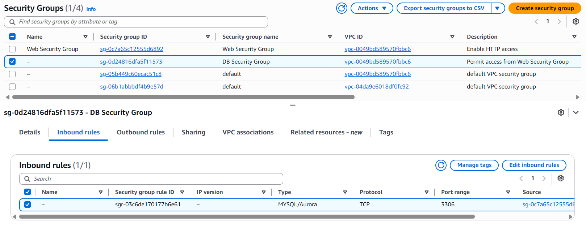
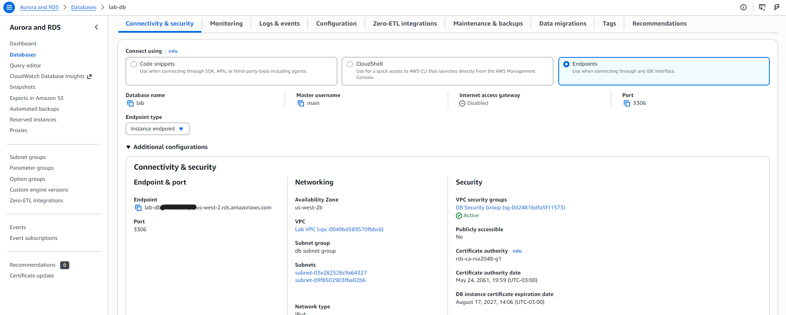
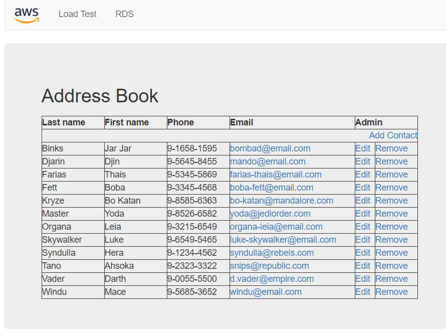

# ☁️ Amazon RDS Multi-AZ Deployment & Web Application Integration

Este projeto demonstra a implementação de uma arquitetura de banco de dados relacional altamente disponível no **Amazon RDS (MySQL)** com implantação **Multi-AZ**, integrada a uma aplicação web hospedada no **Amazon EC2**. 

Desenvolvido como parte do currículo prático de computação em nuvem (AWS Academy).

---

## 🏛️ Arquitetura da Solução

* **Infraestrutura de Rede:** VPC com sub-redes públicas e privadas distribuídas em múltiplas Zonas de Disponibilidade (AZs).
* **Camada de Aplicação:** Servidor EC2 executando a aplicação web em uma sub-rede pública.
* **Camada de Dados:** Instância de Banco de Dados **Amazon RDS MySQL (db.t3.medium)** com replicação síncrona Multi-AZ ativada em sub-redes privadas.
* **Segurança:** Grupos de Segurança (Security Groups) configurados no modelo de menor privilégio, permitindo acesso ao RDS apenas a partir do Security Group da aplicação web na porta 3306.

---

## 🛠️ Tecnologias e Serviços Utilizados

* **Amazon Web Services (AWS):**
  * Amazon RDS (Relational Database Service)
  * Amazon EC2 (Elastic Compute Cloud)
  * Amazon VPC (Virtual Private Cloud)
  * Security Groups & DB Subnet Groups
* **Banco de Dados:** MySQL 8.x
* **Linguagens/Ferramentas:** PHP, HTML/CSS, Git & GitHub

---

## 🚀 Etapas de Implementação

1. **Configuração de Segurança:**
   * Criação do `DB Security Group` vinculando a regra de entrada da porta `3306` exclusivamente ao `Web Security Group`.
2. **Subnet Group do Banco de Dados:**
   * Agrupamento de sub-redes privadas em duas Zonas de Disponibilidade distintas para suporte ao Multi-AZ.
3. **Provisionamento do Amazon RDS:**
   * Criação da instância MySQL `lab-db` no modo Multi-AZ para alta disponibilidade e failover automático.
4. **Integração e Testes:**
   * Conexão da aplicação web via Endpoint do RDS.
   * Validação da persistência de dados no aplicativo de catálogo de endereços (*Address Book*).

---

## 📷 Evidências do Projeto

### 1. Regra do Security Group para o Banco de Dados

### 2. Instância Amazon RDS Multi-AZ Configurada

### 3. Aplicação Funcional Persistindo Dados no MySQL

---

## 🎓 Aprendizados

* Configuração e gerenciamento de banco de dados relacional gerenciado na nuvem AWS.
* Conceitos de Alta Disponibilidade (HA) e Tolerância a Falhas utilizando réplicas síncronas Multi-AZ.
* Boas práticas de segurança de rede em nuvem (segmentação via VPC, Subnets Privadas e isolamento por Security Groups).
